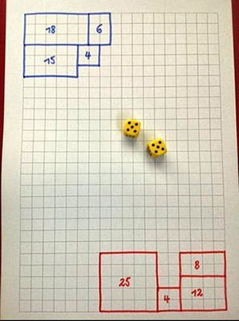

# Diced Bloxx

A simple game. The earliest reference found
at [imgur](https://imgur.com/gallery/ybMoPPb/comment/1523104131)

## Rules

1. roll 2 dice.
1. make a rectangle with the sides generated
1. The rectangle must be connected to your existing territory.
1. The first player's first rectangle is placed in a corner.
   The second player's first rectangle in the opposing corner.
1. If you cannot make the rectangle generated you skip your turn.
1. When all space is filled you end the game.
1. The one with the most territory wins.

## Strategy

Any unclaimed territory cut off from your opponents
territory will eventually be yours. Like the
unnumbered squares in minesweeper it is free real
estate. Try to cut of an area as large as possible
from your opponent to get as much of this as
possible. If both players follow this strategy it's
almost entirely based on luck.

Variations:
You could also eliminate a player when they cannot
place their rectangle. Then the other player get
roll for as long as they can place their rectangles.
This version is much more strategic.
